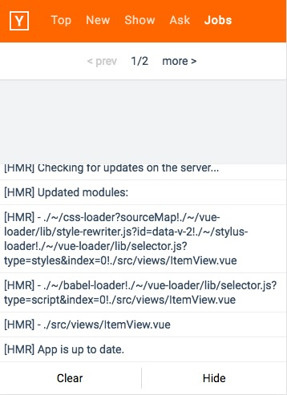

# a better console tool https://github.com/Tencent/vConsole

# console.js

[](https://www.npmjs.com/package/mobile-console.js)
[](https://www.npmjs.com/package/mobile-console.js)

a console panel for mobile phone, replace alert.
https://www.npmjs.com/package/mobile-console.js

Preview
-------

### close status
<div align="center">
    
</div>

### open status
<div align="center">
    
</div>

### build

``` bash
npm run build
```

### install

``` bash
npm i mobile-console.js --save-dev
```

### ES6

```
import 'mobile-console.js';
new MobileConsole();
```

### demo

open `tests/index.html`

### feature

- support to show console.log api output. (info, warn, error, debug)
- support to show js error.
- support to show xhr and fetch's request and response information. (default off)
